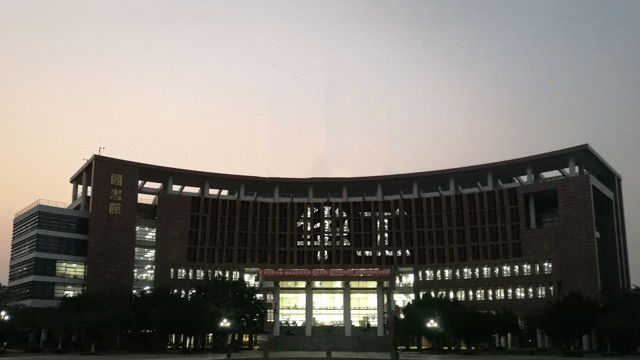

# lightMovie 灯光拼图

### 说明
模拟大楼的灯光拼图的效果

### 用法
在code目录的input.txt中输入想要拼出的字。
第1行为字幕(字幕长度每次不得超过3个字)，第2行为字幕持续的时间(秒)。例如：
```
每天
0.4629
起床
0.4628
第一句
0.6943
```

### 例子
  

### 算法

0. 在PS中抠出背景图(这个是最耗时的)  
1. 以白色为底，拼出带字幕的图片：  
  
2. 把字幕图片插入到底图中，字幕图片中像素值为黑色，即RGB为(0,0,0)的，用灯光的颜色代替，其余不变。

